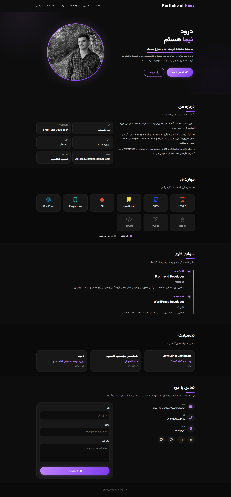

# 🚀 Personal Portfolio - Nima Shafiei

A modern responsive personal portfolio built with **HTML, CSS, and JavaScript**.  
This project showcases my skills, experience, and projects as a front-end developer.

---

## 📸 Preview

---

## ✨ Features

- Fully responsive design (mobile-first)
- Modern dark UI with smooth animations
- Hamburger menu for mobile navigation
- Contact form integrated with EmailJS
- Smooth scrolling navigation
- Clean and modular code structure

---

## 🛠️ Built With

- HTML5
- CSS3 (Flexbox + Grid)
- Vanilla JavaScript
- EmailJS (for contact form)

---

## 📬 Contact Form

This project uses **EmailJS** to send messages directly from the frontend without a backend.

---
